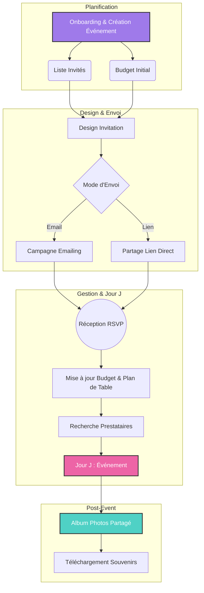
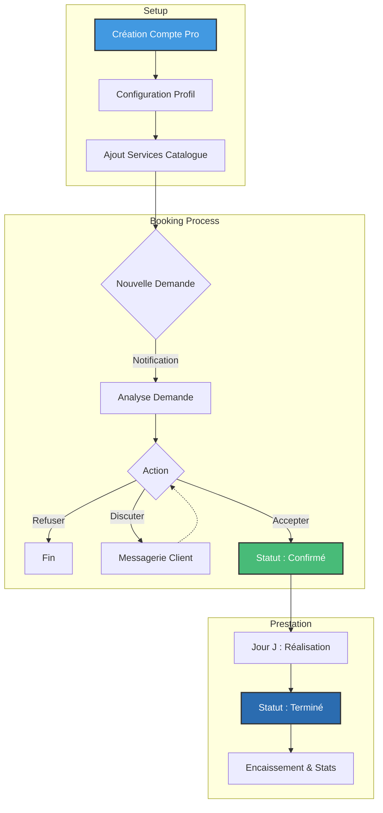

# 🌟 Kawepla - Fonctionnalités et Parcours Utilisateur

Ce document détaille les fonctionnalités de la plateforme Kawepla pour les deux types d'utilisateurs principaux : les **Organisateurs** (Clients) et les **Prestataires**. Il présente également les parcours utilisateurs (User Flows) types.

---

## 👥 Pour les Organisateurs (Clients)

L'organisateur est celui qui planifie un événement (mariage, anniversaire, etc.). Son interface est conçue pour simplifier la gestion de A à Z.

### 1. 💌 Gestion des Invitations & Design
*   **Création Intuitive** : Accès à une galerie de modèles (templates) professionnels.
*   **Éditeur Avancé (Type Canva)** : Personnalisation complète des invitations (textes, polices, couleurs, images) via un éditeur graphique intégré.
*   **Multi-formats** : Création d'invitations web interactives et versions imprimables/partageables.
*   **Envoi Multicanal** :
    *   Envoi par **Email** direct depuis la plateforme.
    *   Génération de **liens partageables** (pour WhatsApp, SMS, réseaux sociaux).

### 2. 📋 Gestion des Invités (Guest List)
*   **Centralisation** : Ajout, modification et suppression des fiches invités (coordonnées, accompagnants).
*   **Import Intelligent** : Importation en masse de listes d'invités via fichiers **Excel (.xlsx)** ou **CSV**.
*   **Suivi RSVP** : Tableau de bord temps réel des réponses (Présent, Absent, Peut-être).
*   **Détails Avancés** : Gestion des **régimes alimentaires**, allergies, et assignation aux groupes (VIP, Famille, Amis).
*   **Communication** : Envoi de rappels automatiques aux retardataires.

### 3. 💰 Gestion Budgétaire (Budget Planner)
*   **Vue d'Ensemble** : Suivi global du budget total, des dépenses engagées et du reste à dépenser.
*   **Catégorisation** : Classement des dépenses par poste (Traiteur, Lieu, Tenues, etc.) avec icônes visuelles.
*   **Suivi des Paiements** :
    *   Suivi des acomptes versés et soldes restants.
    *   Dates d'échéance des paiements.
    *   Indicateurs visuels (Payé / À payer).

### 4. 📸 Photos & Souvenirs
*   **Albums Collaboratifs** : Espace dédié où les invités peuvent uploader leurs photos de l'événement.
*   **Galerie** : Visualisation et téléchargement des souvenirs.

### 5. 🛠️ Outils de Planification
*   **Planning / Tâches** : Gestionnaire de tâches (To-Do List) pour ne rien oublier avant le jour J.
*   **Marketplace (Recherche Prestataires)** : Accès à une liste de prestataires vérifiés pour l'événement.

---

## 👔 Pour les Prestataires (Professionnels)

Le prestataire propose ses services (Traiteur, DJ, Photographe, etc.). Son interface est un outil de gestion d'activité (Extranet).

### 1. 🏪 Gestion des Services (Catalogue)
*   **Création de Services** : Éditeur complet pour référencer ses prestations.
*   **Détails Précis** :
    *   Nom, description détaillée et photos.
    *   **Tarification flexible** : Prix fixe, par personne, ou par heure.
    *   **Capacité** : Nombre de personnes max, durée.
    *   **Inclusions** : Liste détaillée de ce qui est compris dans le service.
*   **Visibilité** : Activation/Désactivation des services en un clic.

### 2. 📅 Gestion des Réservations (Bookings)
*   **Tableau de Bord des Demandes** : Vue centralisée de toutes les demandes de réservation reçues.
*   **Workflow de Validation** :
    *   **En attente** : Nouvelle demande à traiter.
    *   **Confirmé** : Prestation validée.
    *   **Terminé** : Prestation réalisée.
    *   **Annulé / Refusé** : Gestion des annulations.
*   **Détails Réservation** : Accès complet aux infos de l'événement (Date, Heure, Lieu, Type d'événement, Nb invités).

### 3. 💬 Communication & Client
*   **Messagerie Intégrée** : Chat direct avec les clients pour discuter des détails.
*   **Fiches Clients** : Coordonnées (Email, Téléphone) pour un contact rapide.

### 4. 📈 Pilotage d'Activité
*   **Statistiques** : Suivi du nombre de réservations et du Chiffre d'Affaires généré.
*   **Vue Filtrée** : Tri des réservations par statut (pour voir ce qui est à traiter en priorité).

---

## 🔄 User Flow (Parcours Utilisateur)

Voici les étapes typiques d'utilisation de la plateforme pour chaque profil.

### 🟣 Parcours Organisateur : "De l'idée au Jour J"

1.  **Onboarding** : Inscription et définition de l'événement (Date, Type, Lieu).
2.  **Budget Initial** : Définition de l'enveloppe budgétaire globale.
3.  **Création Liste** : Import ou ajout manuel des invités.
4.  **Design Invitation** : Choix d'un modèle -> Personnalisation (Texte/Photo) -> Validation.
5.  **Campagne d'Envoi** : Sélection des destinataires -> Envoi des emails ou partage du lien.
6.  **Gestion Active** :
    *   Réception des RSVP (notifications).
    *   Mise à jour du Budget au fur et à mesure des dépenses.
    *   Recherche et booking de prestataires manquants.
7.  **Post-Événement** : Ouverture de l'album photo pour récupérer les clichés des invités.

### 🔵 Parcours Prestataire : "De la visibilité au Booking"

1.  **Configuration** : Création du profil public et ajout des services (description, prix, photos).
2.  **Réception** : Notification d'une nouvelle demande de réservation.
3.  **Négociation/Validation** :
    *   Échange via messagerie si besoin d'infos comp.
    *   Acceptation de la demande (passage en statut "Confirmé").
4.  **Réalisation** : Accès aux infos pratiques pour le jour J (Lieu, Horaire).
5.  **Clôture** : Une fois l'événement passé, marquage de la réservation comme "Terminée".

